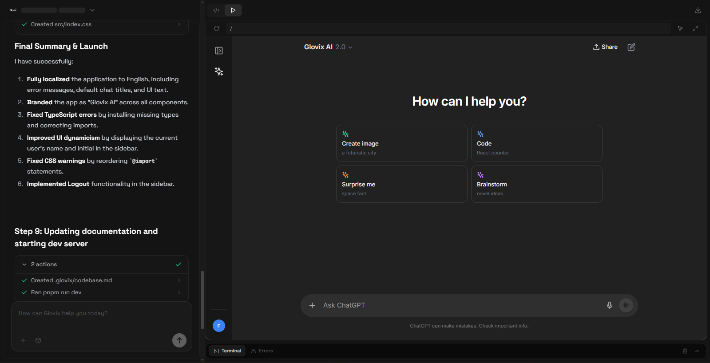
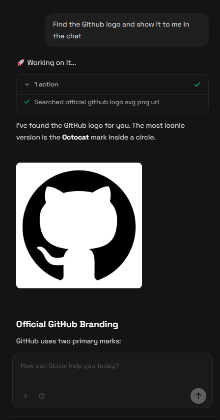
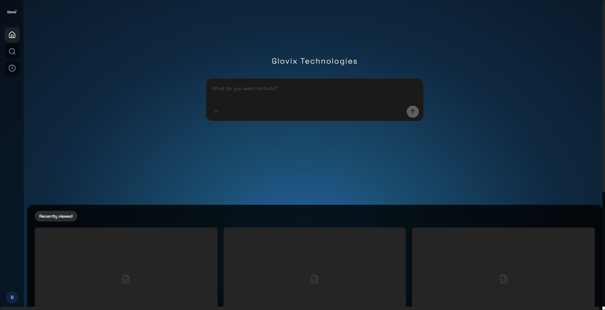

# Glovix Open Source

<div align="center">
  
  <h3>AI-Powered Web Development Environment</h3>
  <p>Build, run, and debug web applications directly in your browser</p>
</div>

## ✨ Features

- 🤖 **AI Assistant** - Intelligent code generation and debugging  
- 💻 **In-Browser Node.js** - Full Node.js environment powered by WebContainers  
- 📝 **Monaco Editor** - VS Code-like editing experience  
- 🎨 **Live Preview** - Real-time application preview  
- 🔧 **Terminal** - Built-in terminal for running commands  
- 📁 **File Explorer** - Intuitive file management  
- 🌓 **Dark/Light Theme** - Customizable appearance  
- 💾 **Local Storage** - No backend required, runs entirely in browser  

## 📸 Screenshots

Place your screenshots in `public/screenshots/` with the exact names below.

- `public/screenshots/s1.png` — IDE view: chat on the left and the application preview on the right  
  

- `public/screenshots/s2.png` — Chat view showing AI finding the GitHub logo  
  

- `public/screenshots/s3.png` — Main menu / home screen  
  

## 🚀 Quick Start

### Prerequisites

- Node.js 18+  
- Chrome-based browser (required for WebContainers)  
- AI Provider API Key (OpenAI, Anthropic, or compatible endpoint)

### Installation

```bash
# Clone the repository
git clone https://github.com/GlovixTechnologies/GlovixTech.git
cd GlovixTech

# Install dependencies
npm install
```

### Configure Environment

```bash
cp .env.example .env
```

Edit `.env` and add your API keys:

```env
VITE_USE_LOCAL_STORAGE=true
VITE_AI_ENDPOINT=https://api.openai.com/v1/chat/completions
VITE_AI_API_KEY=your_api_key_here
VITE_AI_MODEL=gpt-4
VITE_TAVILY_API_KEY=your_tavily_key_here
```

- Set `VITE_USE_LOCAL_STORAGE=true` to run in backend-less local mode.

### Start Development Server

```bash
npm run dev
```

Open your browser at: `http://localhost:5174`

## 🔧 Configuration

### Backend-less Mode

Set `VITE_USE_LOCAL_STORAGE=true` to enable local demo mode:
- Authentication: auto-login with demo user  
- Data Storage: stored in browser localStorage  
- No backend required — runs entirely client-side

### AI Provider Setup

Glovix supports any OpenAI-compatible API endpoint:
- **OpenAI**: `https://api.openai.com/v1/chat/completions`  
- **Anthropic**: use via proxy  
- **Local models**: point to your local LLM server  
- **Custom endpoints**: any compatible API

### Web Search (Optional)

For AI web search capabilities, add a Tavily API key:

```env
VITE_TAVILY_API_KEY=your_key_here
```

## 🏗️ Tech Stack

- **Frontend**: React 18, TypeScript, Vite  
- **Styling**: Tailwind CSS  
- **Editor**: Monaco Editor  
- **Runtime**: WebContainer API  
- **State**: Zustand  
- **Routing**: React Router  
- **Terminal**: xterm.js

## 📦 Build for Production

```bash
npm run build
```

Built files will be in the `dist` directory. Deploy to any static hosting service.

## ✅ How to add the screenshots (quick steps)

1. Create screenshots folder (if missing):

```bash
mkdir -p public/screenshots
```

2. Copy your images into `public/screenshots/` using these exact names:

- `s1.png` — IDE where chat is left and app is right  
- `s2.png` — AI chat where it finds the GitHub logo  
- `s3.png` — main menu / landing

3. Commit and push:

```bash
git add public/screenshots/s1.png public/screenshots/s2.png public/screenshots/s3.png README.md
git commit -m "Add screenshots and update README"
git push origin main
```

> Tip: Optimize images before committing (e.g., use ImageMagick or an image optimizer). Example with ImageMagick:
>
> ```bash
> convert input.png -resize 1200x800\> -strip -quality 85 public/screenshots/s1.png
> ```

## 🤝 Contributing

We welcome contributions! See [CONTRIBUTING.md](CONTRIBUTING.md) for guidelines.

1. Fork the repo  
2. Create a branch (`git checkout -b feat/my-feature`)  
3. Make changes and add tests where appropriate  
4. Open a pull request with a clear description of changes

## 📄 License

Apache License 2.0 - see [LICENSE](LICENSE) for details.

## 🙏 Acknowledgments

- [WebContainer API](https://webcontainers.io/) by StackBlitz  
- [Monaco Editor](https://microsoft.github.io/monaco-editor/) by Microsoft  
- All our amazing contributors

## 📞 Support

- 📧 Email: mail@askhub.tech

---
<div align="center">
  Made with ❤️ by the Glovix Team
</div>
